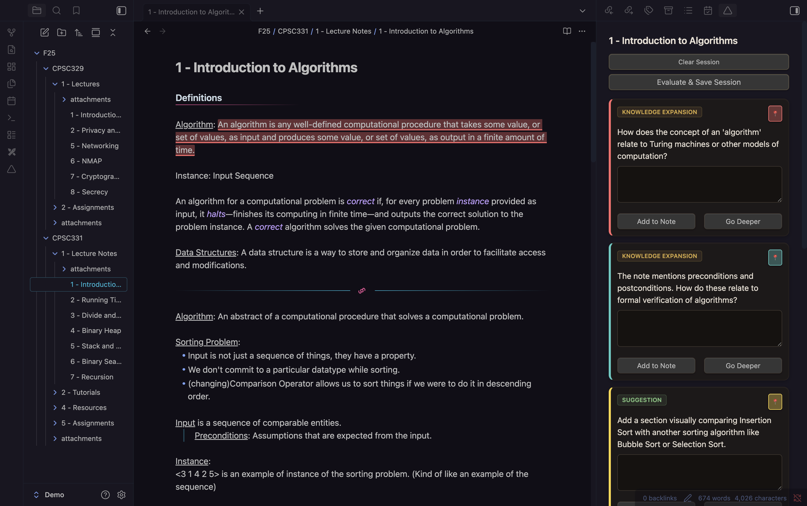
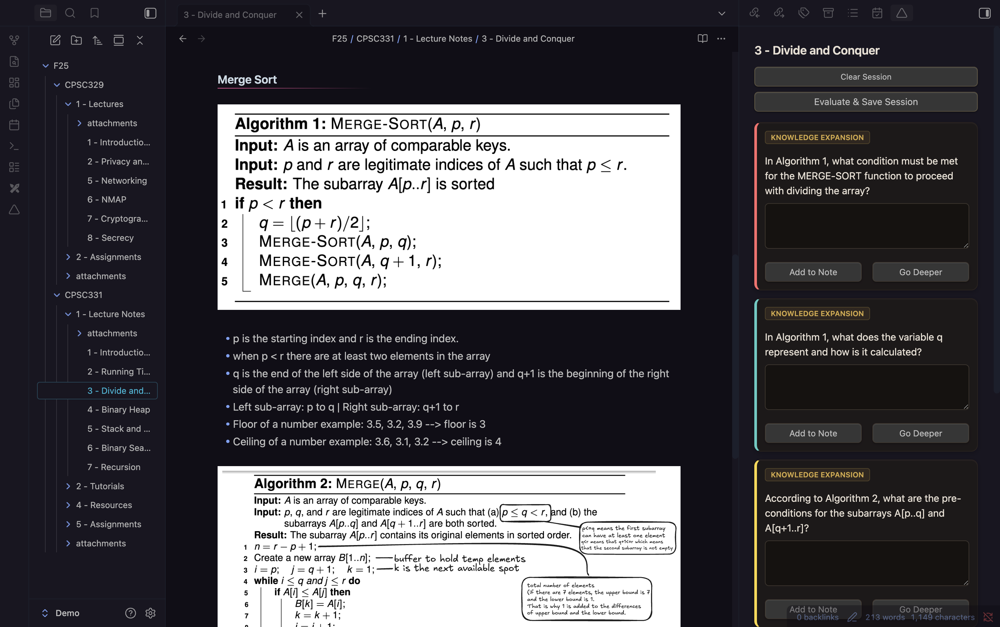
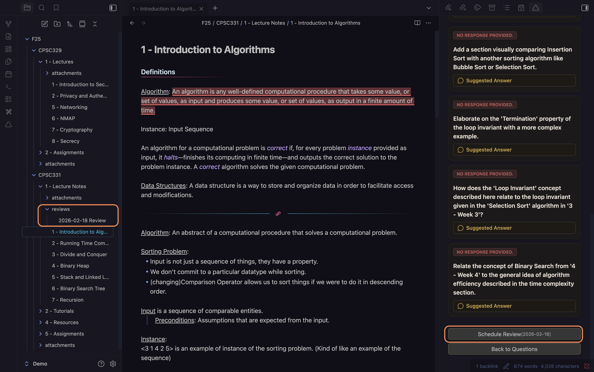

# Deep Notes

  

<!-- Add more badges as needed -->

Deep Notes is a professional, production-ready Obsidian plugin designed to act as a Socratic tutor for your notes. It helps you actively recall information, connect concepts across your vault, and deepen your understanding through recursive questioning. Built for long-term use and ongoing support, Deep Notes transforms note-taking from a collection mechanic into a learning mechanic.

## Core Features

### Socratic Questioning
- Analyzes your current note and generates:
  1. **Knowledge Expansion**: Probing questions to test your understanding.
  2. **Cross-Topic Connections**: Questions linking your note to other relevant notes.
  3. **Suggestions**: Actionable advice to improve clarity or depth.

### "Go Deeper" (Recursive Learning)
- Select any generated question and request a follow-up based on your answer.
- The AI analyzes your response and generates a specific follow-up question.
- Creates a nested thread of dialogue, simulating a real tutoring session.

### Active Evaluation
- Scores your answers based on semantic similarity to ideal answers.
- Provides specific feedback and highlights the source text in your note.

### Vault Indexing (Semantic Search)
- Builds a local vector index of your vault for semantic search and cross-topic questions.
- Ensures referenced notes exist, preventing broken links.

### Multimodal Support (OCR & Vision)
- Scans images in your notes using OCR or Vision Models.
- Parses text from Excalidraw drawings for richer context.

### Spaced Repetition Integration
- Schedules reviews based on your evaluation score, supporting long-term retention.

---

## Installation

### From Obsidian Community Plugins
1. Open Obsidian Settings > **Community Plugins**.
2. Turn off "Safe Mode".
3. Click **Browse** and search for "Deep Notes".
4. Click **Install** and then **Enable**.

### Manual Installation
1. Download the latest release from [GitHub Releases](https://github.com/buhariE/Deep-Notes/releases).
2. Copy `main.js`, `manifest.json`, and `styles.css` (if present) to your `.obsidian/plugins/deep-notes/` folder.
3. Restart Obsidian and enable the plugin.

### Configuration
Go to **Settings > Deep Notes** to configure your AI provider and other options.

---

## Configuration: Setting Up API Keys

To use Deep Notes with cloud AI providers (Gemini, OpenAI, Anthropic), you must provide your own API keys:

1. Open Obsidian Settings > Deep Notes.
2. Select your preferred AI provider (Gemini, OpenAI, Anthropic, or Ollama).
3. For Gemini, OpenAI, or Anthropic:
   - Enter your API key in the corresponding field.
   - You can obtain API keys from your provider's developer portal:
     - [Google Gemini](https://aistudio.google.com/app/apikey)
     - [OpenAI](https://platform.openai.com/account/api-keys)
     - [Anthropic](https://console.anthropic.com/settings/keys)
4. For Ollama (local), no API key is required, but you must have Ollama running on your machine.

Your API keys are stored securely in your local Obsidian configuration and are never shared.

---

## Using Ollama (Local LLM)

To use Deep Notes with Ollama (local AI models):

1. Download and install Ollama from the official website: [https://ollama.com/](https://ollama.com/)
2. Start Ollama by running `ollama serve` in your terminal.
3. In Obsidian, go to Settings > Deep Notes and select "Ollama (Local)" as your provider.
4. Optionally, pull specific models (e.g., `ollama pull llama3.2:latest`) as needed.

No API key is required for Ollama. All processing happens locally on your machine.

---

## Usage

1. Open any note in Obsidian.
2. Click the **Deep Notes icon △** or run the command `Deep Notes: Open Deep Notes View`.
3. Click **Generate Questions** to start your learning session.
4. Answer questions, use "Go Deeper" for follow-ups, and evaluate your answers.
5. Schedule reviews and track your progress over time.

---

## Contribution

We welcome contributions from the community! To contribute:
- Fork the repository and create a new branch for your feature or fix.
- Submit a pull request with a clear description of your changes.
- Please follow our code style and add tests where appropriate.

For questions or suggestions, see the contact information in the [Support & Authors](#support--authors) section.

---

## License

This project is licensed under the MIT License. See the [LICENSE](./LICENSE) file for details.

---

## Support & Authors

If you encounter issues, need help, or want to provide feedback, please open an issue on [GitHub Issues](https://github.com/buhariE/Deep-Notes/issues) or contact the maintainers directly:

- Aaditya Dhungana — aadityaincode@gmail.com
- Emmanuel Buhari — manuelbuhari@gmail.com
- Noah Hong Anh Khoa — noahnghgwork@gmail.com
- Toby Allan — tobyallan00@gmail.com
- Muhammad Zohaib Talat — zohaibtalat@gmail.com

## Buy Us a Coffee

If you enjoy Deep Notes and want to support further development, you can buy us a coffee!

  

