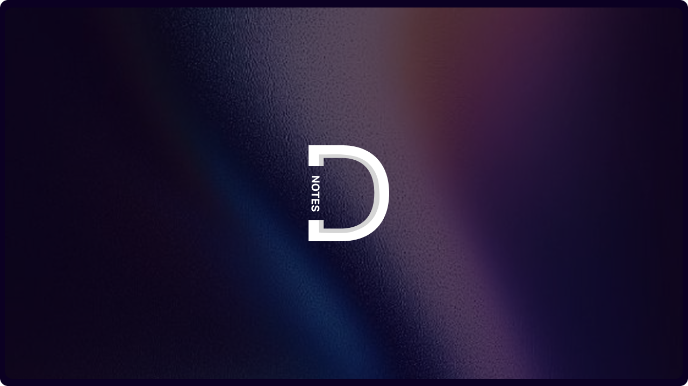

# Deep Notes

  

Deep Notes is an Obsidian plugin designed to act as a Socratic tutor for your notes. Instead of passively reading or summarizing, it challenges you to actively recall information, connect concepts across your vault, and deepen your understanding through recursive questioning.

Its primary goal is to transform note-taking from a collection mechanic into a learning mechanic.

## Core Features

### Socratic Questioning
The plugin analyzes your current note and generates three types of items:
1.  **Knowledge Expansion**: Probing questions that test your understanding of the specific note content.
2.  **Cross-Topic Connections**: Questions that semantically link the current note to other relevant notes in your vault.
3.  **Suggestions**: Actionable advice on how to improve the note's clarity or depth.

### "Go Deeper" (Recursive Learning)
Learning is rarely linear. The "Go Deeper" feature allows you to select any generated question and request a follow-up based on your initial answer.
-   The AI analyzes your response in the context of the original note.
-   It generates a specific follow-up question to clear up misconceptions or push for more detail.
-   This creates a nested thread of dialogue, simulating a real tutoring session.

### Active Evaluation
After answering questions, you can trigger an evaluation. The system:
-   Scores your answers based on semantic similarity to ideal answers.
-   Provides specific feedback on where you were correct, partially correct, or incorrect.
-    highlights the exact source text in your note that inspired the question, allowing for quick verification.

### Vault Indexing (Semantic Search)
Deep Notes builds a local vector index of your vault.
-   It chunks your notes and generates embeddings (using local models or APIs).
-   This allows the plugin to find "Related Concepts" from other files even if they don't share keywords, enabling the **Cross-Topic** questions.
-   **Cross-topic validation**: If the AI references a note that doesn't exist in your vault, the question is automatically demoted to a knowledge-expansion question so you never see a broken link.

### Multimodal Support (OCR & Vision)
-   **Images**: The plugin can scan images in your notes using OCR (Tesseract) or Vision Models (Gemini 2.0 Flash).
-   **Excalidraw**: It natively parses text elements from embedded Excalidraw drawings.
-   This allows the AI to ask questions about charts, diagrams, and handwritten notes.

### Spaced Repetition Integration
Based on your evaluation score, the plugin schedules a review in a `reviews/` subfolder next to the source note.

| Score | Review Delay |
|-------|--------------|
| ≥ 90% | 14 days |
| ≥ 75% | 7 days |
| ≥ 50% | 3 days |
| < 50% | 1 day |

-   The review file is created at e.g. `Lecture Notes/reviews/2026-02-22 Review.md`.
-   If multiple notes schedule reviews for the same date, they are appended to the same file.

---

## Setup

### 1. Installation
1.  Open Obsidian Settings > **Community Plugins**.
2.  Turn off "Safe Mode".
3.  Click **Browse** and search for "Deep Notes".
4.  Click **Install** and then **Enable**.

### 2. Configuration
Go to **Settings > Deep Notes**.

#### AI Provider
Choose your backend:
-   **Cloud (Recommended for Ease)**: Select OpenAI, Anthropic, or Gemini. Enter your API key.
-   **Local (Ollama)**: Select "Ollama". Ensure you have [Ollama](https://ollama.com/) installed and running (`ollama serve`).
    -   Default URL: `http://127.0.0.1:11434`

#### Vision & Embeddings
-   **Image Scanning**: Enable "Vision Provider" (Gemini 2.0 Flash or Ollama `llava`).
-   **Embeddings**: Choose "Gemini" (requires API key) or "Ollama" (requires `nomic-embed-text` model).
    -   *Note*: If using Ollama for embeddings, run `ollama pull nomic-embed-text` in your terminal first.

---

## BRAT (Beta Reviewers Auto-update Tester) Installation

You can install Deep Notes directly from GitHub using the BRAT plugin (no manual build required):

1. Install the **BRAT** plugin from Obsidian's Community Plugins.
2. In BRAT settings, click **Add Beta Plugin**.
3. Paste this repo URL: `https://github.com/buhariE/Deep-Notes.git`
4. Click **Install**. Deep Notes will auto-update with every new release.

After installation, follow the configuration steps below to set up your AI provider (Ollama or API keys).

---

## Usage

### 1. Generate Questions
-   Open any note in Obsidian.
-   Click the **Deep Notes icon** (triangle) in the ribbon or run the command `Deep Notes: Open Deep Notes View`.
-   Click **Generate Questions**. The AI will read your note and create 6 items (Questions, Suggestions, Connections).

### 2. Answer & "Go Deeper"
-   Type your answer in the text box.
-   **Go Deeper**: Want to challenge yourself? Click "Go Deeper" after answering. The AI will ask a follow-up question based on your specific response.
-   **Add to Note**: Click "Add to Note" to insert the Q&A pair directly into your file, right after the relevant paragraph.

### 3. Evaluate
-   Once you've answered a few questions, click **Evaluate & Save Session**.
-   The AI scores your answers (0-100%) and gives feedback:
    -   **Correct**: Green badge.
    -   **Partial**: Yellow badge.
    -   **Incorrect**: Red badge.

### 4. Review
-   Click **Schedule Review** to create a review note in a `reviews/` subfolder next to the current note, scheduled based on your score.
-   Access past sessions via the **History** button to retake quizzes.

---

## Technical Implementation

### Architecture
The plugin is built with a modular architecture to separate UI, Logic, and State:
-   **State Management**: It uses a recursive data structure (`DeepNotesItem`) to handle nested questions and responses. State is persisted in a local LRU cache to survive view reloads.
-   **Vector Store**: A lightweight, in-memory vector store that persists to `vectors/index.json`. It uses cosine similarity to find relevant context.
-   **AI Abstraction**: A unified interface supports multiple providers (Gemini, Anthropic, OpenAI, and local LLMs via Ollama) for both text generation and embeddings.

### Intelligent Context
Unlike simple wrappers that send the entire file to an LLM, Deep Notes uses a RAG-lite approach:
-   It retrieves the active note content.
-   It queries the local vector store for the top 3-5 semantically related chunks from *other* notes.
-   It combines these into a context window to generate questions that bridge concepts.

### Recursive UI
The main view (`DeepNotesView`) implements a recursive rendering engine.
-   Standard questions are rendered as top-level cards.
-   "Go Deeper" triggers a sub-render of the nested `subItems` array, creating an indented thread.
-   This allows for infinite depth in conversation threads without cluttering the interface.

### Context-Aware Insertion
When you choose to "Add to Note", the plugin finds the exact excerpt in your file that the question refers to.
-   It uses a fuzzy search algorithm to locate the source text.
-   It inserts the Q&A block immediately after that paragraph, preserving the flow of your document.

---

## Privacy & Local-First Design
Deep Notes is designed to work with your privacy preferences.
-   **Ollama Support**: You can run the entire pipeline (Generation, Embeddings, Evaluation) locally using Ollama.
-   **API Keys**: If you use cloud providers (Gemini, OpenAI), your keys are stored securely in Obsidian's local configuration.
-   **Data**: Your notes and the vector index never leave your machine except when explicitly sending a prompt to your chosen AI provider.

---

## Authors
- Aaditya Dhungana
- Emmanuel Buhari
- Noah Hong Anh Khoa
- Toby Allan
- Zohaib Talat

---

## **CALGARY HACKS 2026**

